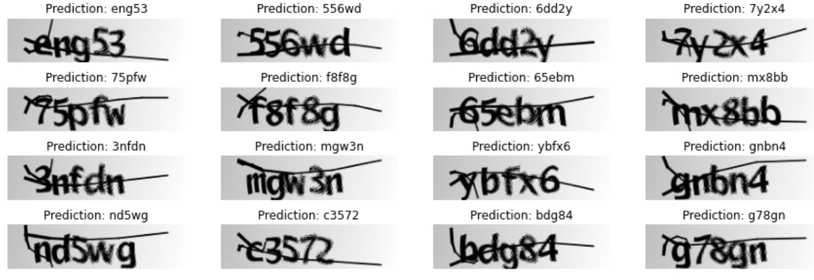
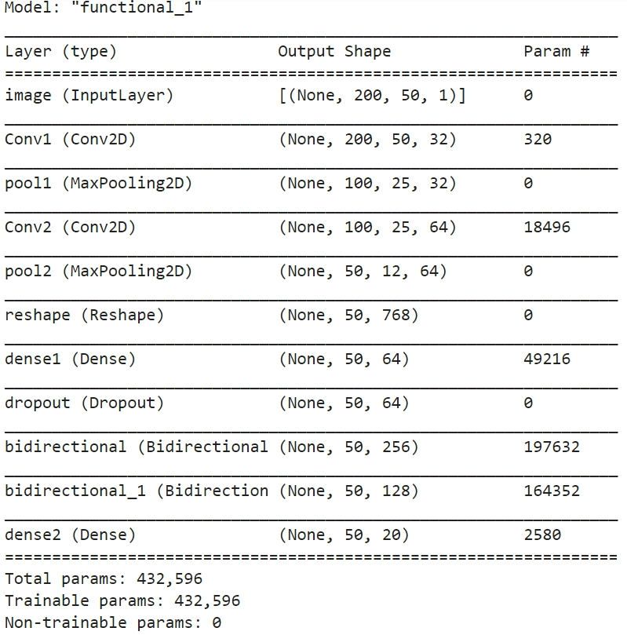

# ocr-captchas

A pratice of OCR model for recognition Captchas by Tensorflow.Keras

# Data
Dataset is from Kaggle's CAPTCHA Images. 

[Link](https://www.kaggle.com/fournierp/captcha-version-2-images)

# Result

 

# Learning curve

 

# model
CRNN + CTC loss

 
